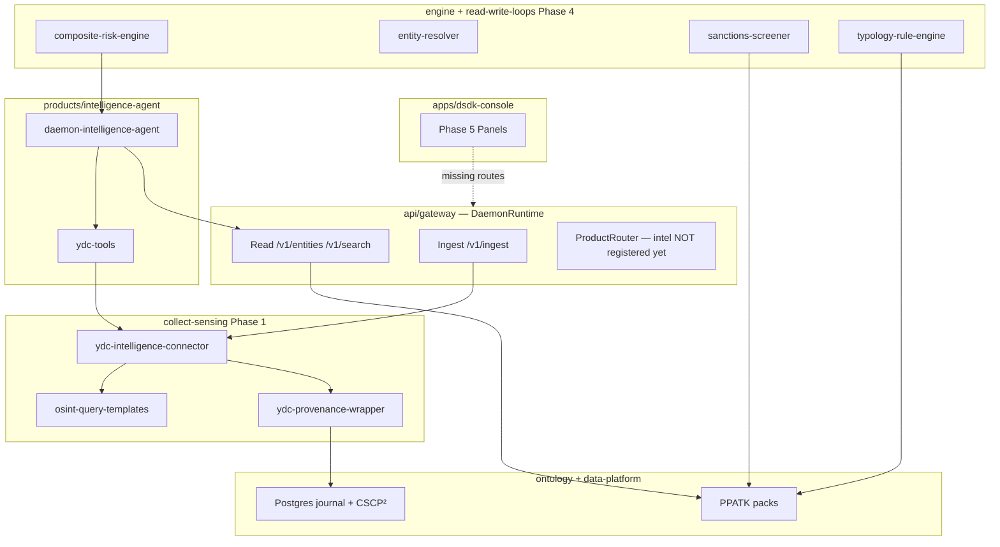

# Product Requirements Document (PRD)

**Project Name:** Daemon Ontology Intelligence Platform  
**Platform:** [daemon-sdk](../) monorepo (`@daemon/*`)  
**Date:** June 6, 2026 (updated)  
**Status:** Phase 0–1 **shipped (code + unit tests)** · Phase 2–5 **scaffolded, not gateway-integrated**  
**Primary Stakeholders:** Financial Intelligence Units (e.g., PPATK), Compliance Officers, Threat Intelligence Analysts

**Related docs:** [00-overview.md](./00-overview.md) · [02-bounded-contexts.md](./02-bounded-contexts.md) · [PPATK pack guide](../configs/ontology/packs/extensions/PPATK_README.md)

---

## 1. Executive Summary

Daemon Ontology Intelligence Platform adalah **product vertical** di atas **daemon-sdk** — semantic control plane enterprise yang sudah menyediakan ingest, ontology, governed read/write, search hybrid, lakehouse, dan security governance.

Product intel ini menambahkan:

- Pengumpulan OSINT (Surface Web) via You.com (YDC)
- Sinyal dark web (clearnet + crawler Tor terencana)
- Ontology packs PPATK/INTRAC (AML, crypto, OSINT, darkweb, netintel)
- Agen investigasi LLM (LangGraph + deepagents)
- Mesin risiko, sanctions screening, dan typology PPATK
- Dashboard investigasi di DSDK Console

**Cryptographic Provenance (CSCP²)** diimplementasikan di layer platform (`data-platform/provenance/`) dan wajib untuk chain-of-custody bukti intelijen (UU No. 8 Tahun 2010 tentang PPATK).

### Positioning vs core platform

| Layer | Wajib untuk gateway jalan? | Intel dependency |
|-------|----------------------------|------------------|
| `api/gateway`, `ontology`, `read-write-loops`, `collect-sensing`, `data-platform` | **Ya** | Fondasi |
| PPATK ontology packs + YDC connectors (Phase 0–1) | Tidak | Fondasi intel |
| `@daemon/intelligence-agent` + dashboard Phase 5 | Tidak | Product opsional |
| Phase 2–4 engines & subagents | Tidak | Dibutuhkan sebelum go-live intel penuh |

Core platform dapat di-deploy dan diuji (`pnpm run dev:gateway`, `pnpm run test:repo`) **tanpa** product intel. Sebaliknya, go-live intel **membutuhkan** core platform + Phase 0–1 minimal.

---

## 2. Product Vision & Goals

**Vision:** Tulang punggung intelijen finansial proaktif — agen AI dan analis manusia mengungkap jaringan TPPU/TPPT melintasi Surface Web, Dark Web, dan on-chain.

**Goals:**

1. Mengotomatisasi penemuan indikator risiko dari OSINT dan dark web.
2. Mempercepat draf Suspicious Transaction Report (STR / LTMS).
3. Menjamin keaslian bukti sejak koleksi hingga pengadilan (CSCP²).
4. Melacak pergerakan aset (taint propagation) via Neo4j + Rust logic engine.

**Non-goals (current release):**

- Visual Link Analysis drag-and-drop (Phase 6+)
- Full on-chain node tracing tanpa pihak ketiga (Phase 6+)
- Automated subpoena generation (Phase 6+)

---

## 3. Target Personas

| Persona | Kebutuhan utama |
|---------|-----------------|
| **Financial Investigator / Analis PPATK** | Graph analysis, pola Structuring/Layering, ringkasan transaksi |
| **Cyber Threat Intel Analyst** | Marketplace/forum dark web, PII leaks, PGP keys ↔ crypto wallets |
| **Compliance Officer (bank/VASP)** | Sanctions screener (DTTOT, UN, OFAC), review draf STR |

---

## 4. Implementation Status (Phases 0–5)

Status per fase — **Done** = kode + unit test ada; **Integrated** = terdaftar di gateway / `ProductRouter` / ingest catalog production-ready.

### Phase 0 — Foundation & scaffolding

| ID | Deliverable | Status | Path |
|----|-------------|--------|------|
| 0.1 | Agent paths & repo layout | Done | `products/intelligence-agent/paths.ts` |
| 0.2 | PPATK ontology extension packs (6 packs) | Done | `configs/ontology/packs/extensions/` · [PPATK_README](../configs/ontology/packs/extensions/PPATK_README.md) |
| 0.3 | Composite risk engine | Done | `engine/logic-engine/risk-scoring/composite-risk-engine.ts` |
| 0.4 | STR/LTMS report generator | Done | `products/intelligence-agent/tools/compliance/str-report-generator.ts` |
| 0.5 | Agent skills & memory templates | Done | `products/intelligence-agent/skills/`, `memory/` |

### Phase 1 — OSINT collection & provenance wiring

| ID | Deliverable | Status | Path |
|----|-------------|--------|------|
| 1.1 | YDC intelligence connector (search/contents/research) | Done · Integrated (ingest) | `collect-sensing/connectors/api-connectors/ydc-intelligence-connector.ts` |
| 1.2 | OSINT query templates (PPATK-oriented) | Done | `collect-sensing/connectors/api-connectors/osint-query-templates.ts` |
| 1.3 | YDC provenance wrapper | Done | `collect-sensing/connectors/api-connectors/ydc-provenance-wrapper.ts` |
| 1.4 | YDC credit monitor | Done | `collect-sensing/connectors/api-connectors/ydc-credit-monitor.ts` |
| 1.5 | Source catalog + connector factory wiring | Done · Integrated | `collect-sensing/orchestrator/source-catalog.ts`, `connector-factory.ts` |
| 1.6 | Source config | Done | `sources/ydc-intelligence.yaml`, `YDC_API_KEY` in `.env.example` |

**Platform Phase 1 (terpisah, shared):** CSCP² provenance — Done di `data-platform/provenance/`, optional at runtime via journal `EpochManager`.

**Cara pakai Phase 1 hari ini:** ingest via gateway `POST /v1/ingest/sources/:sourceId/run` dengan source type `ydc-intelligence` (lihat connectors catalog). Tidak memerlukan LangGraph agent.

### Phase 2 — Intelligence agent product

| ID | Deliverable | Status | Path |
|----|-------------|--------|------|
| 2.1 | LLM orchestrator (deepagents) | Done · **not gateway-wired** | `products/intelligence-agent/agent/daemon-intelligence-agent.ts` |
| 2.2 | YDC LangChain tools | Done | `products/intelligence-agent/agent/ydc-tools.ts` |
| 2.3 | OSINT + graph analyst subagents | Done | `subagents/osint-analyst.ts`, `graph-analyst.ts` |
| 2.4 | Darkweb + STR narrator subagents | Done | `subagents/darkweb-analyst.ts`, `str-narrator.ts` |
| 2.5 | Daemon API read tools + darkweb surface monitor | Done | `daemon-api-tools.ts`, `services/darkweb-surface-monitor.ts` |
| 2.6 | Cross-domain fusion query profile | Done | `products/ontology-query/fusion-profile/intelligence-fusion.ts` |

**Invocation today:** `pnpm --filter @daemon/intelligence-agent dev` (standalone). **Belum** terdaftar di `products/product-shell/product-router.ts` (`ProductId`).

### Phase 3 — Dark web active monitor (Go)

| ID | Deliverable | Status | Path |
|----|-------------|--------|------|
| 3.1 | Signing adapter (dual-control hooks) | Done | `collect-sensing/connectors/darkweb-crawler/` (signing in TS layer) |
| 3.2 | Tor SOCKS5 proxy | Scaffold | `collect-sensing/connectors/darkweb-crawler/tor_proxy.go` |
| 3.3 | Crawler | Scaffold | `collect-sensing/connectors/darkweb-crawler/crawler.go` |
| 3.4 | Marketplace indexer | Scaffold | `marketplace_indexer.go` |
| 3.5 | Target whitelist config | Done | `sources/darkweb-targets/whitelist.example.yaml` |

Go crawler **belum** terintegrasi ke ingest orchestrator production path. Memerlukan dual-control authorization sebelum aktivasi.

### Phase 4 — Intelligence engines

| ID | Deliverable | Status | Path |
|----|-------------|--------|------|
| 4.1 | Entity resolver (Jaro-Winkler) | Done | `engine/logic-engine/entity-resolution/entity-resolver.ts` |
| 4.2 | Taint propagation (Rust) | Done | `engine/logic-engine/src/lib.rs` |
| 4.3 | Sanctions screener (DTTOT, UN, OFAC) | Done · not loop-wired | `read-write-loops/loop-controller/sanctions-screener.ts` |
| 4.4 | Typology rule engine (PPATK) | Done · not loop-wired | `read-write-loops/loop-controller/typology-rule-engine.ts` |

Engines dapat di-unit-test independen; **belum** dipanggil otomatis dari write-loop propagation untuk semua typology targets di `configs/governance/propagation.yaml`.

### Phase 5 — Intelligence dashboard (DSDK Console)

| ID | Deliverable | Status | Path |
|----|-------------|--------|------|
| 5.1 | Intelligence Panel (OSINT / darkweb / graph) | UI Done · **API missing** | `apps/dsdk-console/src/panels/IntelligencePanel.tsx` |
| 5.2 | Case Management Panel | UI Done · **API missing** | `CaseManagementPanel.tsx` |
| 5.3 | STR Review Board | UI Done · **API missing** | `STRReviewPanel.tsx` |
| 5.4 | YDC Credit Monitor | UI Done · **API missing** | `CreditMonitorPanel.tsx` |

Console panels memanggil endpoint seperti `POST /api/v1/intelligence/osint-scan` — **endpoint ini belum ada** di `api/gateway`. UI ahead of backend.

---

## 5. Features & Requirements

### 5.1. Core Intelligence Agent (Phase 2)

- **LLM Intelligence Orchestrator:** Koordinasi tools YDC + read-only gateway (`/v1/entities`, `/v1/search`, `/health`) dengan tenant headers.
- **Graph Analyst Subagent:** Navigasi Neo4j untuk pola TPPU (Circular, Hub-and-Spoke, Shell Chain).
- **STR Narrator Subagent:** Draf STR/LTMS dari data kasus + risk breakdown.
- **Entity Resolver (Phase 4.1):** Fuzzy (Jaro-Winkler) + exact match NIK/NPWP/wallet.

**Acceptance (Phase 2 complete):**

- [ ] `@daemon/intelligence-agent` registered as `ProductId` in `product-router.ts`
- [ ] Gateway route `POST /v1/products/intelligence-agent/chat` (or equivalent)
- [ ] E2E test with `YDC_API_KEY` optional skip in CI (deterministic fixtures)

### 5.2. Data Collection & Monitoring (Phase 1 + 3)

- **OSINT Collector:** YDC search/contents/research; credit charging + hard limits.
- **Dark Web Monitor:** Tor-isolated Go crawler; whitelist-only targets; `AuthorizedBy` + `AuthorizationDate` required.
- **Sanctions Screener:** Continuous screening DTTOT, UN SC, OFAC (`sources/sanctions/`).

**Acceptance (Phase 1 complete):** ✅ Connector tests pass; source in catalog; provenance wrapper signs payloads.

**Acceptance (Phase 3 complete):**

- [ ] Go crawler in CI (`go test ./collect-sensing/connectors/darkweb-crawler/...`)
- [ ] Ingest job type in connector factory with policy gate
- [ ] Dual-control audit trail in `security-governance/audit/`

### 5.3. Logic & Risk Engine (Phase 0.3 + 4)

- **Composite Risk Engine:** Weighted dimensions (transaction, taint, sanctions, adverse media, darkweb, PEP).
- **Typology Rule Engine:** PPATK typologies as executable rules.
- **Taint Propagation (Rust):** FIFO / Poison / Haircut methods.

**Acceptance (Phase 4 integrated):**

- [ ] Propagation targets `typology-rule-engine`, `sanctions-screen`, `taint-recompute` invoke loop controllers on write
- [ ] Integration test: ingest wallet → taint label → STR typology hit

### 5.4. Intelligence Dashboard (Phase 5)

- **Intelligence Panel:** Trigger OSINT / darkweb surface / graph preview.
- **Case Management:** Kanban/table investigasi.
- **STR Review Board:** Human-in-the-loop approve/reject AI drafts.
- **API Credit Monitor:** YDC balance, spend, alerts.

**Acceptance (Phase 5 complete):**

- [ ] Gateway REST handlers backing each panel
- [ ] Console smoke test against local gateway
- [ ] RBAC: `ppatk.intel_analyst`, `ppatk.compliance_lead` from action catalog

---

## 6. System Architecture

### Tech stack

| Layer | Stack |
|-------|-------|
| Frontend | React 19, Vite, TypeScript (`apps/dsdk-console`) |
| API | NestJS (`api/gateway`), `@daemon/api-rest` |
| Agent | LangGraph, deepagents, `@daemon/intelligence-agent` |
| Ingest | TypeScript + Go (`collect-sensing`) |
| Logic | Rust (`engine/logic-engine`), TypeScript engines |
| Storage | PostgreSQL (journal, cases), Neo4j (graph), Redis (cache/queue) |
| OSINT API | You.com YDC (`YDC_API_KEY`) |

### Bounded-context rules (intel must comply)

- Gateway services **must not** import `globalRegistry` or `CommandGateway` directly — use `DaemonRuntime`.
- Ingest stays in **collect-sensing**; semantic truth in **ontology**; governed writes in **read-write-loops**.
- Tenant scope: headers `X-Daemon-Tenant`, `X-Daemon-Domain`.

---

## 7. Security, Compliance & Legal

1. **CSCP²:** SMT-based provenance in `data-platform/provenance/`; YDC wrapper signs at ingest boundary.
2. **Dual-control authorization:** Dark web activation requires `AuthorizedBy` + `AuthorizationDate` (UU 8/2010 Pasal 44).
3. **Data privacy:** RBAC + field masking for NIK/nama; tenant pack composition limits intel layers for PJK pelapor (see PPATK_README).
4. **Connector tiers:** `internal` / `restricted` / `regulated` / `sensitive` in connectors catalog.

---

## 8. Rollout Strategy (recommended)

Prioritas berdasarkan dependency dan risiko CI/integrasi:

| Priority | Scope | Rationale |
|----------|-------|-----------|
| **P0 — Keep** | Phase 0–1, PPATK packs, CSCP² platform | Fondasi intel; reusable via ingest tanpa agent |
| **P1 — Next** | Gateway product registration + intel REST routes | Unblocks Phase 5 UI |
| **P2** | Phase 4 propagation wiring | Production typology/sanctions on write |
| **P3** | Phase 2 agent E2E | Requires `YDC_API_KEY` or fixtures |
| **P4 — Defer** | Phase 3 Go Tor crawler | Isolated, high-risk, needs infra + legal sign-off |

**Optional rollback:** Phase 2–5 code may be reverted temporarily to stabilize CI while retaining Phase 0–1 connectors and ontology packs. Core daemon-sdk is unaffected.

---

## 9. Success Metrics (KPIs)

| Metric | Target |
|--------|--------|
| OSINT analysis time | < 5 menit / entitas (vs ~4 jam manual) |
| STR draft acceptance | > 85% approved with < 15% text edits |
| Graph anomaly detection | Structuring/Layering in seconds at 1M+ nodes |
| YDC cost per case | < $0.20 USD |

KPIs are **not measurable in production** until Phase 5 APIs and Phase 2 gateway integration ship.

---

## 10. Future Roadmap (Phase 6+)

1. **Visual Link Analysis (VLA):** Interactive graph widget (IBM i2–style).
2. **Crypto on-chain enrichment:** Direct BTC/ETH node tracing.
3. **Automated subpoena generation:** Draft data requests from graph gaps.

---

## 11. Open Items & Document History

| Date | Change |
|------|--------|
| 2026-06-06 | Initial PRD (Phases 0–5 marked completed) |
| 2026-06-06 | **Updated:** Honest status matrix; gateway integration gaps; rollout priority; positioning vs daemon-sdk core |

**Open engineering items:**

1. Register `intelligence-agent` in `ProductId` / `ProductRouter`.
2. Implement gateway routes for console panels (`/v1/intelligence/*`).
3. Wire sanctions/typology engines to propagation executor.
4. Add intel integration tests to `test:repo` (optional `YDC_API_KEY`).
5. Complete Go darkweb crawler ingest path with dual-control gate.

---

*Maintained by Daemon Architect Agent · align with [00-overview.md](./00-overview.md) platform milestones.*
